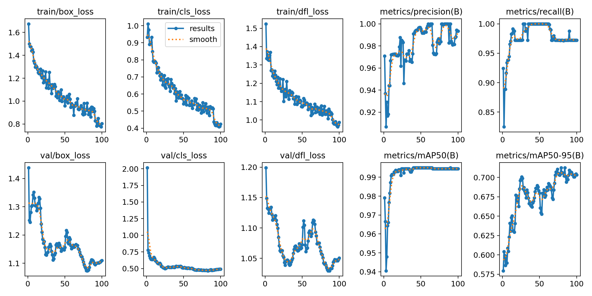
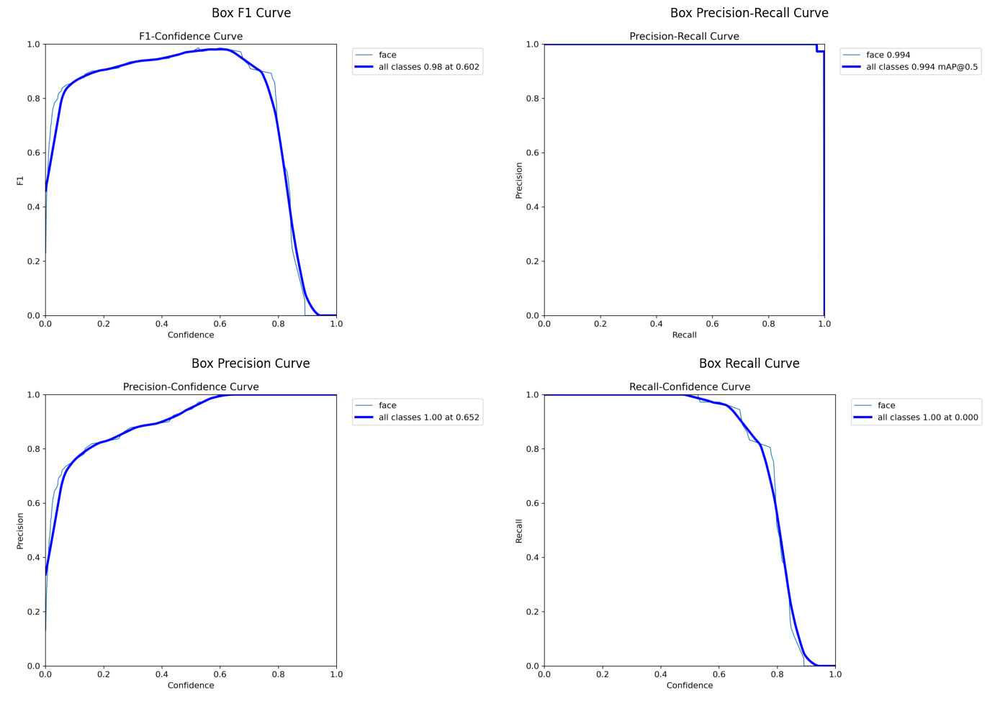
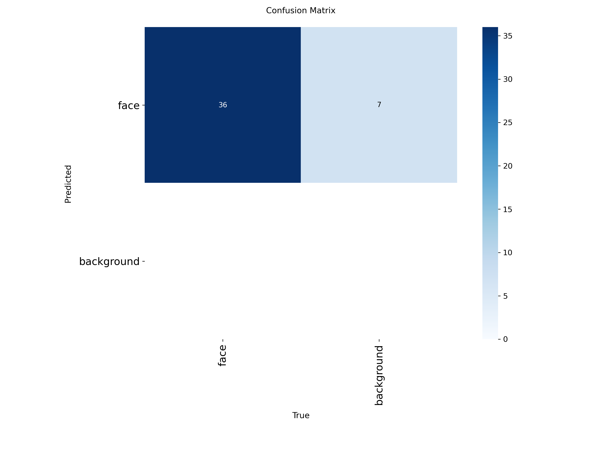

# YOLOv11n Face Detection & People Counting

A real-time face detection and people counting system using YOLOv11n, fine-tuned on a custom dataset using Roboflow platform. This project implements transfer learning, object tracking, and a counting zone to monitor people crossing a virtual line.

## Project Purpose

This project demonstrates:
1. **Custom Dataset Creation**: Generate and augment a face detection dataset using Roboflow
2. **Transfer Learning**: Fine-tune YOLOv11n model for face detection
3. **People Counting**: Implement a counting zone to track people crossing a virtual line
4. **Performance Evaluation**: Measure model performance using mAP and FPS metrics
5. **Robustness Testing**: Validate the solution on test video

## Project Structure

```
YOLOv11n-face-detection/
├── assets/
├── images/                          # Test images
├── models/
│   └── best.pt                      # Fine-tuned model weights
├── outputs/                         # Detection results
|   ├── predict/                     # Image or video predictions
|   └── track/                       # Tracking videos with counting zone
├── src/                             
|   ├── counter.py                   # People counting with tracking scripts
|   └── detect.py                    # Basic detection script
├── videos/                          # Test videos
├── requirements.txt                 # Python dependencies
└── YOLOv11_Face_FineTuning.ipynb    # Training notebook
```

## Setup Instructions

### 1. Clone the Repository

```bash
git clone https://github.com/yccccc12/YOLOv11n-face-detection.git
cd YOLOv11n-face-detection
```

### 2. Create Python Virtual Environment

**Windows:**
```bash
python -m venv venv
venv\Scripts\activate
```

**macOS/Linux:**
```bash
python3 -m venv venv
source venv/bin/activate
```

### 3. Install Dependencies

```bash
pip install --upgrade pip
pip install -r requirements.txt
```

### 4. Download the Model

If you want to fine-tune the model with your own dataset, modify the Roboflow code in the training notebook (`YOLOv11_Face_FineTuning.ipynb`) with your project details:

```python
!pip install roboflow

from roboflow import Roboflow
rf = Roboflow()
project = rf.workspace("YOUR_WORKSPACE").project("YOUR_PROJECT")
version = project.version(1) 
dataset = version.download("yolov11")
```
Then, run the training notebook.
The fine-tuned model, `best.pt` will be generated automatically and saved at the end of training.
You can then replace the existing model in the models/ directory with the new `best.pt` file.

If you’re using the pre-trained model provided, this step can be skipped

## Dataset Preparation

The dataset is prepared through the Roboflow platform since it provide function like data augmentation, image collection from other user, easy to upload own data and so forth.

### Using Roboflow for Custom Dataset

1. **Collect Images**: 63 images are collected from different angles, lighting, backgrounds
2. **Annotate Faces**: All faces occured in images are labelled with bounding boxes
3. **Preprocessing**
   - Auto-Orient: Applied
   - Resize: Stretch to 640x640
   - Auto-Adjust Contrast: Using Contrast Stretching
4. **Augmentation Applied**:
   - Outputs per training example: 3
   - Flip: Horizontal
   - 90° Rotate: Clockwise, Counter-Clockwise, Upside Down
   - Crop: 0% Minimum Zoom, 6% Maximum Zoom
   - Rotation: Between -10° and +10°
   - Shear: ±10° Horizontal, ±10° Vertical
   - Saturation: Between -10% and +10%
   - Brightness: Between -15% and +15%
   - Exposure: Between -10% and +10%
   - Blur: Up to 1.5px
   - Noise: Up to 0.1% of pixels
   ** After augementation, there are total 133 iamges
5. **Dataset Split**: Train set (79%), Valid set (10%) and test set (11%)

### Augmentation Benefits

- Increases dataset size by 3-5x
- Improves model generalization
- Reduces overfitting
- Enhances robustness to various conditions

## Model Training

### Fine-Tuning YOLOv11n

This project uses a pre-trained YOLOv11n face detection model from Hugging Face as the starting point for transfer learning.

**Base Model**: [AdamCodd/YOLOv11n-face-detection](https://huggingface.co/AdamCodd/YOLOv11n-face-detection)

**Regularization Applied:**
- Pretrained weights (transfer learning)
- Freeze early layers (`freeze=10`) to retain backbone features of base model
- Batch normalization tp stabilize training process
- Monitor validation mAP during training
- Apply lower learning rate (`lr0=0.001`) to prevent large updates during fine-tuning
- Adopt Adam optimizer that provide stable adaptive learning rate

## Usage

### 1. Basic Face Detection

Run detection on images or videos using `detect.py`:

```bash
python src/detect.py
```

**Configuration** (edit in `detect.py`):
```python
MODEL_PATH = 'models/best.pt'
INPUT_PATH = 'videos/vid1.mp4' # Input file path (image or video) to run detection on
OUTPUT_PATH = 'outputs'
```
**Sample Result**  
The image below shows the detection output using the fine-tuned YOLOv11 model.


*Figure 1: Face detection result showing bounding boxes and confidence scores on test image*

### 2. People Counting with Tracking

Run people counting using `counter.py`:

```bash
python src/counter.py
```

**Configuration** (edit in `counter.py`):
```python
MODEL_PATH = "models/best.pt"
VIDEO_PATH = "videos/vid2.mp4" # Input file path (video) to run detection on
OUTPUT_PATH = "outputs/track"
```

**Sample Result**  
The GIF below demonstrates people counting with object tracking using the fine-tuned YOLOv11 model.

\
*Figure 2: Real-time people counting demonstration with object tracking and virtual counting line*


**Features:**
- Virtual counting line at frame center
- IN counter (left to right crossing)
- OUT counter (right to left crossing)
- Track ID assignment

**Controls:**
For video prediction:
- Press `q` to stop video playback
- Results automatically saved to output directory

## Detection Results

The detection results are saved under the `outputs/` folder. \
-> `outputs/predict` stored the result for normal face detection like images or videos\
-> `outputs/track` stored the video of people counting prediction

You are feel free to try on your own images or videos but make sure upload them to the corresponding subfolder and remember to modify the input path name under the `detect.py` or `counter.py` scripts.

## Performance Metrics

The model's performance was evaluated using various metrics during training and validation. Below are the key performance indicators:

### Mean Average Precision (mAP)

Evaluated on validation set:
- **mAP@0.5**: Measures detection accuracy at 50% IoU threshold
- **mAP@0.5:0.95**: Average mAP across IoU thresholds from 0.5 to 0.95 (COCO metric)


*Figure 3: Training and validation metrics over epochs showing mAP, precision, recall, and loss curves*


*Figure 4: Precision-Recall and F1-Confidence curves demonstrating model performance*

### Model Performance Analysis


*Figure 5: Confusion matrix showing classification accuracy for face detection*

**Key Observations:**
- **High Detection Accuracy**: The model achieves strong precision and recall on the validation set, demonstrating reliable face detection capabilities across various conditions
- **Stable Training**: Training curves show smooth convergence without significant overfitting, indicating effective regularization through frozen layers and lower learning rate
- **Robust Classification**: The confusion matrix demonstrates high true positive detection rates with minimal false positives, validating the model's reliability in real-world scenarios
- **Transfer Learning Benefits**: Fine-tuning from the pre-trained YOLOv11n model significantly accelerated training and improved performance compared to training from scratch, leveraging learned features from the base model
- **Generalization**: Data augmentation combined with transfer learning enables the model to perform well on unseen test data with varying lighting, angles, and backgrounds

### Frames Per Second (FPS)

Real-time processing speed:
- **CPU Processing**: ~3-8 FPS (suitable for offline video analysis)
- **GPU Processing**: ~25-60 FPS (suitable for real-time applications)
- Measured during video inference and displayed in console output

**Example Output (CPU):**
```
Final In Count: 6
Final Out Count: 3
Average Processing FPS: 3.88
```
Above are the output for the processed video (`videos/vid2.mp4`)

**FPS Performance Analysis:**
- **Processing Speed**: 3.88 FPS indicates slower-than-realtime performance (6.4x slower than 25 FPS standard)
- **Primary Cause**: CPU-only processing without GPU acceleration
- **Processing Time**: A 10-second video requires ~64 seconds to process
- **Contributing Factors**: 640x640 input resolution, object tracking overhead, and hardware limitations
- **Use Case**: Suitable for offline batch processing; GPU recommended for real-time applications

The result suggested that CPU processing is sufficient for offline video analysis and people counting. GPU acceleration is recommended for real-time applications.

## Conclusion

This project successfully demonstrates an end-to-end implementation of face detection and people counting using YOLOv11n transfer learning.

**Achievements:**
1. **Custom Dataset**: Created 133 augmented images from 63 base images using Roboflow (3x augmentation)
2. **Model Training**: Fine-tuned YOLOv11n with high precision/recall and minimal overfitting
3. **People Counting**: Implemented tracking system

**Performance:**
- Strong detection accuracy with minimal false positives
- CPU: 3.88 FPS (offline processing)

**Applications:**
- Retail traffic analysis
- Building occupancy monitoring
- Event attendance tracking
- Security and access control

**Key Takeaways:**
- Transfer learning effective with limited data (133 images)
- Data augmentation crucial for generalization
- Regularization (frozen layers, lower LR) prevents overfitting
- Hardware choice depends on use case: CPU for offline, GPU for real-time

### Future Enhancements

### Future Enhancements

- **GPU Acceleration**: Implement CUDA support for real-time processing (25-60 FPS)
- **Advanced Tracking**: Integrate DeepSORT or ByteTrack for improved accuracy
- **Multi-Camera System**: Support multiple camera angles for comprehensive coverage
- **Analytics Dashboard**: Real-time visualization with historical trends and occupancy alerts
- **Dataset Expansion**: Include crowded scenes, extreme lighting, and occlusion cases
- **Model Variants**: Train on larger YOLOv11 models (s, m, l) for higher accuracy
- **Extended Features**: Face mask detection, age/gender classification

This project provides a foundation for building production-ready people counting systems with clear performance considerations.

## License

This project is for educational purposes.

## Acknowledgments

- [Huggingface YOLOv11](https://huggingface.co/AdamCodd/YOLOv11n-face-detection)
- [Roboflow](https://roboflow.com/) for dataset management
- OpenCV community
